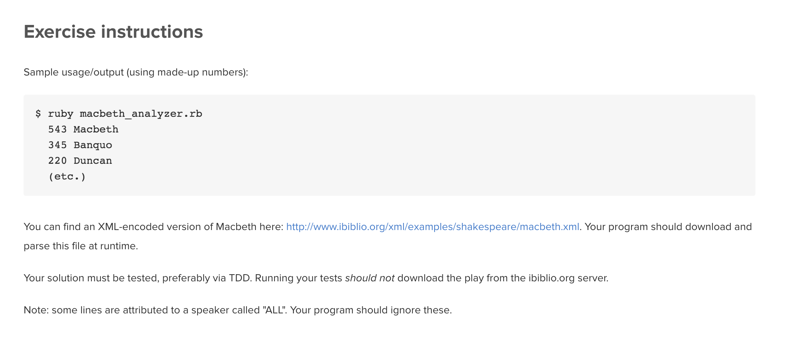

As a Shakespeare buff, statistics junkie, and Unix lover, Ben finds himself wanting a command-line tool for analyzing Macbeth.  

Write a command-line program that prints the number of lines spoken by each character in the play.  

[http://www.ibiblio.org/xml/examples/shakespeare/macbeth.xml](http://www.ibiblio.org/xml/examples/shakespeare/macbeth.xml)
